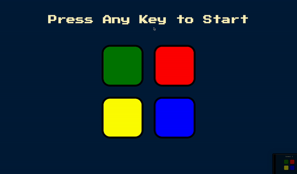

# Simon-Game-no-jQuery

Same as Simon-Game, but without the use of jQuery.

This is a simple game made as part of the course
[The Complete 2024 Web Development Bootcamp](https://www.udemy.com/course/the-complete-web-development-bootcamp/)

## How to play

The game is very simple, after the game starts:

- A color will flash, lets say blue
- You have to click the blue box
- Another color will flash, let's say red
- You have to click first the blue, than the red
- Another color will flash, let's say red again
- You have to click blue, red, red
- ...

If you make a mistake, you lose and have the option to start again.
